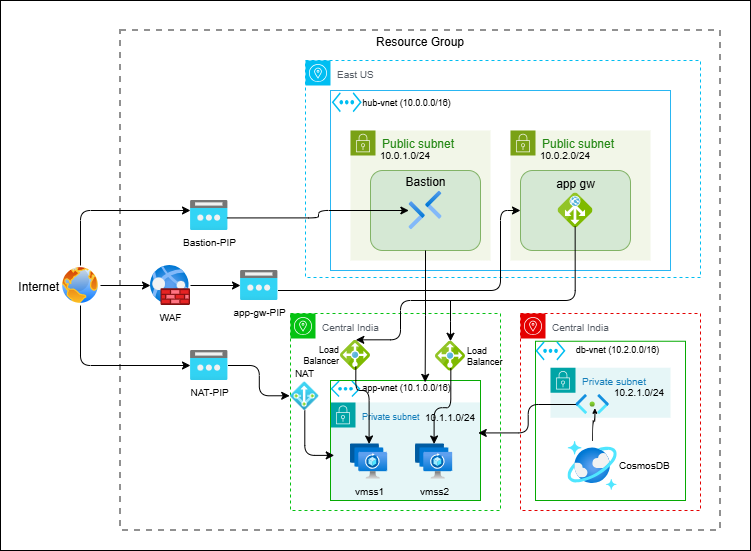

# Secure Multi-Region Azure Architecture

This project demonstrates a production-grade multi-region Azure deployment using:

- Application Gateway + WAF
- VM Scale Sets (VMSS)
- Internal Load Balancer
- Cosmos DB
- Private Endpoints
- VNet Peering
- Bastion
- High Availability Architecture

---

# Architecture Diagram



---

# Architecture Presentation

[Download PPT](../files/global-vnet-peering.pptx)

---

# Architecture Overview

This architecture is designed using secure multi-region VNet peering between East US and Central India.

Traffic Flow:

```text
Internet User
      ↓
Application Gateway + WAF
      ↓
VNet Peering
      ↓
Internal Load Balancer
      ↓
VMSS Instances
      ↓
Cosmos DB Private Endpoint
```

---

# Components Used

| Component | Purpose |
|---|---|
| Bastion | Secure administrative access |
| Application Gateway | SSL termination and routing |
| WAF | Protects against OWASP attacks |
| VMSS | Autoscaling application servers |
| Internal Load Balancer | Internal traffic distribution |
| Cosmos DB | Distributed NoSQL database |
| Private Endpoint | Secure DB communication |
| VNet Peering | Private cross-region connectivity |

---

# High Availability Features

- VMSS autoscaling
- Multiple VM instances
- Internal load balancing
- Multi-region deployment
- Cosmos DB redundancy
- WAF_v2 resiliency

---

# Security Features

- Private subnets
- WAF protection
- NSGs
- Private endpoints
- Bastion access
- No public database exposure

---

# Regions Used

| Region | Purpose |
|---|---|
| East US | Gateway and ingress layer |
| Central India | Application and database workloads |
